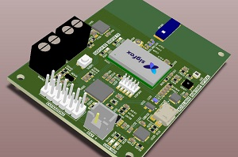
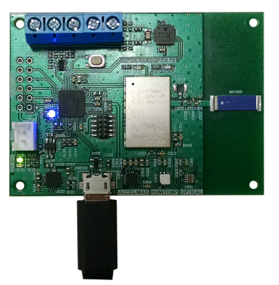
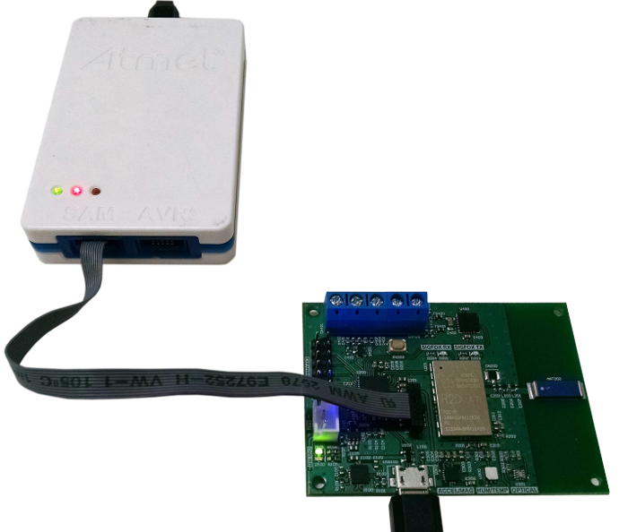

<a name="top"></a>
<br>
uDEV Soluções Tecnológicas Ltda<br>
SIGFOX Embedded Development Kit (EDK)
=====================================

* [Introduction](#Introduction)
* [Getting Started](#getting-started)
* [Connecting your EDK](#connecting-your-edk)
* [Test programs](#test-programs)
* [Low-power Operation](#low-power-operation)
* [Headers and Functions](#headers-and-functions)
    * [Analog Input](#analog-input--input_analogich)
    * [One-Wire Temperature Sensor (DS18B20)](#one-wire-temperature-sensor-ds18b20--ds18b20h)
    * [Emulated EEPROM Memory](#eepromflash_eepromh)
    * [Events](#eventseventsh)
    * [6-Axis Sensor with Linear Accelerometer and Magnetometer (FXOS8700CQ)](#6-axis-sensor-with-linear-accelerometer-and-magnetometer-fxos8700cqfxos8700cqh)
    * [General-Purpose Input/Output (GPIO)](#general-purpose-inputoutput-gpio--gpioh)
    * [Real-Time Clock (RTC)](#real-time-clock-rtc--rtch)
    * [Ambient Light Sensor (SI1133)](#light-sensor-si1133si1133h)
    * [Temperature & Humidity Sensor (SI7021)](#temperature-and-humidity-sensor-si7021--si7021h)
    * [SIGFOX Modem / Radio](#sigfox-modem--radio--radioh)
    * [USB and Debugging](#usb-and-debugging)
    	* [Console_USB.h](#console_usbh)
    	* [Debug.h](#debugh)
    * [Thermocouple Input (MCP9600)](#thermocouple-inputmcp9600h)
* [Useful Links](#useful-links)

## Introduction

This is a repository for examples and source code (excluding libraries and sensitive information) regarding the uDEV Embedded Development Kit (EDK), a multi-sensor board designed for developers and users who wish to create quick and complete solutions without the need for additional sensors.
<br>The EDK is distributed through the [SIGFOX Partners network](https://partners.sigfox.com/products/multi-sensor-sigfox-embedded-development-kit-edk), and available to purchase [directly from us](http://udev.com.br/).


<br>_A 3D model of the uDEV EDK_

To contact us directly, please send an e-mail to [contato@udev.com.br](mailto:contato@udev.com.br).

We have made available files that can be used to test your board, or as templates for bigger projects.
<br>These examples can be used to read the value of each sensor on the board, and from there you can develop your program and start using your EDK. 

<sub>[Back to top](#top)</sub>

## Getting Started

We recommend having the following software to work on your EDK:
* Atmel Studio 7.0
* Microchip's SAM Bootloader Assistant (SAM-BA) 2.17
* A terminal software of your choice
Check our [useful links section](#useful-links) to find where to obtain these.

When writing your application, it is of utmost importance to pay attention to its memory addressing.
<br><u>Your program __MUST__ be built with its Flash Memory address starting at 0x6000. Lower addresses are reserved for our Bootloader.</u>
<br>To write any program on the board via USB, you may use SAM-BA (version 2.16 or 2.17 are guaranteed to work).
<br>Refer to our full manual for a guide for installing and using your EDK with SAM-BA.

__Instructions on how to change your program's memory address, install and use SAM-BA are in our full manual, available at this GitHub page.__

Note that addressing instructions are available only for Atmel Studio 7.0.
<br>In this manual you will also find information on each sensor, along with their datasheets and full specifications.

<sub>[Back to top](#top)</sub>

## Connecting your EDK

To connect your EDK to your computer via USB, simply plug in the Micro USB cable. From there on, you can use SAM-BA to upload to the board the binary file of any application you wish.
<br>The board should turn on with a solid blue light, indicating it is on _Bootloader Mode_.
<br>It can enter this state with an application already uploaded, by keeping the button pressed while powering up the board.



When using an on-chip programmer, such as the ATMEL-ICE, you may write your program directly from Atmel Studio 7.0 or similar.



<b>When using a programmer to write directly to the chip, remember to write your program starting at the address 0x6000 or higher,
or you'll risk writing over the bootloader!</b>

<sub>[Back to top](#top)</sub>

## Test Programs

In this repository you'll find many example files, to run and test your EDK board.
<br>Use the static library we generated from our board configuration files to run your tests. _(Link to be available soon. If needed, send a request to [contato@udev.com.br](mailto:contato@udev.com.br) and we'll do our best to accomodate your needs.)_

We have created a generic __template__ for Atmel Studio 7.0, so that you can quickly create projects for the uDEV Sigfox EDK, without needing to choose the type of processor and set all the parameters every time.
<br>The process of installing templates in Atmel Studio is described at length in our __full manual__, please refer to it as a step-by-step guide if needed.

We will make available a zipped folder that includes all of our headers, and the library needed to compile and execute applicatons.
<br>You'll need to extract the contents of said .ZIP to the /sdk/ directory that will be created within your project, and then add the Library to Atmel Studio. Use our manual on a step-by-step guide for how to add libraries to a project.
<br>Also available is a LED Example Template, which you can use to quickly operate the LED in your board, testing it without having to add any other headers to the project, aside from the static library.


The files in the /Example/ folder in this GitHub contains all you need to run the program immediately, provided your EDK is connected in _Bootloader Mode_. Simply download the folder of which example you want to install, and open the __.cproj__ file. Atmel Studio will generate a new solution for your example, and you will be able to run it.
<br>Feel free to modify the program as you desire, to fit your testing needs.

<sub>[Back to top](#top)</sub>

## Low-power operation

This board is designed to operate in situations that require low-power, such as IoT applications without easy access to replace batteries.
<br>In order to use USB Debugging, the board cannot be in low-power mode. USB connection requires a minimum of constant power, and that isn't supplied in low-power mode.

Low-power mode is the <b>default</b>, and as such, will not permit the use of USB serial communications with a terminal or alike.

Operation mode is dictated by a boolean variable that can be present at the start of your program. If this variable isn't declared, the program will start in low-power mode.
<br>
The code below will start the system in low-power, same as the default case.
```c
bool __b_system_low_power_enabled_ = true;
```

To use the USB serial communication, the variable must be <b>false</b>:
```c
bool __b_system_low_power_enabled__ = false;
```

Either way, the variable definition must be global, before the user setup and loop functions.

<sub>[Back to top](#top)</sub>

## Headers and Functions

For some components, we opted to provide two methods of measurement.
<br>We named these methods the _Callback Mode_ and the _Blocking Mode_.
* The way we recommend doing it is using the _Callback Mode_, which allow the program to keep running uninterrupted, and have the callback function called automatically after the measurement is complete.
* The other method we provided is the _Blocking Mode_: After starting a new measurement, the entire program execution is halted until said measurement is complete.

<sub>[Back to top](#top)</sub>

---
### Analog Input <br/> input_analogic.h

This header contains functions for measuring analog input and battery voltage.

| Function | Description | Parameters | Return type |
| --- | --- | --- | --- |
| fnINPUT_ANALOGIC_Init() | Initializes the analog input component. | None | None |
| fnINPUT_ANALOGIC_Read_Value (_en_input_analogic_definition_t_ __en_input__,<br> _uint16_t_ * __p_adc_raw__,<br> _uint16_t_ * __p_adc_mv__) | Returns the value measured in the analog input or the battery voltage. | __en_input__: Defines what to measure. <br><b>INPUT_ANALOGIC_DEFINITION_VBAT</b> for battery voltage;<br><b>INPUT_ANALOGIC_DEFINITION_4_20_MA</b> for analog input voltage; <br>__p_adc_raw__: A pointer to the value that contains the raw value converted by the analog-digital converter (ADC); <br>__p_adc_mv__: A pointer to the value that has the value converted by the ADC, in volts (V); | None<sup><a name="1analogup">[1](#1analog)</a></sup> |

<sup><a name="1analog">[1](#1analogup)</a></sup><sub><i>This function returns the values via pointers. Define two __uint16_t__ variables, and assign their addresses to the function parameters. The variable values will contain the results.</i></sub>

<sub>[Back to top](#top)</sub>

---
### One-Wire Temperature Sensor (DS18B20) <br/> ds18b20.h

Use this header to implement temperature readings using the DS18B20 sensor, with a 1-wire thermometer connected to the analog input connectors.

To properly use the analog input with the DS18B20 Temperature Sensor, the EDK has to be slightly modified.
<br>Please refer to the __Board Modifications__ folder to see which components need to be present in each configuration.

| Function | Description | Parameters | Return type |
| --- | --- | --- | --- |
| fnDS18B20_Init() | Initializes the DS18B20 sensor. Returns __true__ when no errors occur, and __false__ if the wire is not present or some other error occurs | None | __bool__<sup><a name="1ds18b20up">[1](#1ds18b20)</a></sup> |
| fnDS18B20_Measure_Start_Blocking_Mode() | Begins a new temperature measurement, in _blocking mode_. | None | __bool__<sup><a name="1ds18b20up">[1](#1ds18b20)</a></sup> |
| fnDS18B20_Measure_Start_Callback_Mode() | Begins a new temperature measurement, in _callback mode_. | None | __bool__<sup><a name="2ds18b20up">[2](#2ds18b20)</a></sup> |
| fnDS18B20_Measure_Done_Callback() | This function gets called automatically after a measurement in _callback mode_ is finished. | None | None |
| fnDS18B20_Get_Data_Pointer() | Returns a _const_ pointer to the struct that has all the raw data obtained. Check the header for info on the struct. | None | _const_ __st_ds18b20_data_t*__ |
| fnDS18B20_Get_Temperature() | Returns a _float_ in proper temperature format, in degrees Celsius. | None | __float__ |

<sup><a name="1ds18b20">[1](#1ds18b20up)</a></sup><sub>Returns __true__ when it ends without errors.</sub>
<br><sup><a name="2ds18b20">[2](#2ds18b20up)</a></sup><sub>Returns __true__ after calling the _Callback_ function.</sub>

<sub>[Back to top](#top)</sub>

---
### EEPROM<br/>flash_eeprom.h

This is an emulated EEPROM, from within the board's Flash Memory.
<br>Be aware that the maximum EEPROM size is 60 bytes. Any requests to read or write not within address values in 0-59 bytes will be ignored by the routine.
<br>This module is initialized by default, hence there is no "Init" function. 

| Function | Description | Parameters | Return type |
| --- | --- | --- | --- |
| fnEEPROM_Get_Value(_uint8_t_ __u8_address__) | Returns the contents of the specified address in the EEPROM. If the address is larger than the maximum memory address, returns 0xFF. | __u8_address__: Address of the content to access. | __uint8_t__ |
| fnEEPROM_Set_Value(_uint8_t_ __u8_address__, _uint8_t_ __u8_value__) | Sets and readies a value to be written to a certain address in the EEPROM. | __u8_address__: The address to which the data is to be written.<br>__u8_value__: The data to be written. | None |
| fnEEPROM_Get_Value_Array(_uint8_t_ __u8_address__) | Returns a 4-byte array of values, starting at the address specified. | __u8_address__: The starting address of the array | _const_ __uint8_t__ |
| fnEEPROM_Set_Value_Array(_uint8_t_ __u8_address__, _uint8_t *_ __pu8_value__, _uint8_t_ __u8_size__) | Readies a byte array of a specific size to be written in the EEPROM memory. | __u8_address__: The starting address on which to store the array.<br>__pu8_value__: The array variable you want to write in the EEPROM.<br>__u8_size__: The size of said array. | None |
| fnEEPROM_Commit() | Effectively writes to the emulated EEPROM, with the value and address set previously, in the _Set_Value_ function. | None | None |

<sub>[Back to top](#top)</sub>

---

### Events<br/>events.h

This header has functions for events that the system monitors. There are two possible methods to observe and make use of these events. A list of possible events is below the following tables.

### Attaching method
| Function | Description | Parameters | Return type |
| --- | --- | --- | --- |
| fnEVENT_Attach_Callback(_en_event_t_ __en_event__, <br>_pfn_event_callback_t_ __pfn_callback__) | Attaches a function to an event, so that the function will be called when the event occurs. | __en_event__: The event to be associated with the function<br>__pfn_callback__: The function to be called when the event occurs | __bool__<sup>[1](#1event)</sup> |
| fnEVENT_Deattach_Callback (_en_event_t_ __en_event__) | Deattaches any callback function associated with the event. | __en_event__: The event whose callbacks are to be detached. | __bool__<sup><a name="1eventup">[1](#1event)</a></sup> |

### Switch method
| Function | Description | Parameters | Return type |
| --- | --- | --- | --- |
| fnEVENT_Callback(_en_event_t_ __en_event__) | A function that gets called when any event occurs, and you can implement how it reacts to each one.<sup><a name="2eventup">[2](#2event)</a></sup> | __en_event__: The event that occurred. | None |

The possible __events__ are:
* __EVENT_SYSTEM_NONE__: A default event, never occurs.
* __EVENT_SYSTEM_INIT__: Occurs once at the bootup of the system.
* __EVENT_SYSTEM_RTC__: This event occurs every one (1) second, using the Real-Time Clock.
* __EVENT_INPUT_BUTTON_PRESS__: Occurs when the user button is pressed down.
* __EVENT_INPUT_BUTTON_RELEASE__: Occurs when the user button is released.
* __EVENT_INPUT_BUTTON_PRESS_HOLD__: When the user button is pressed and held down, this event occurs.
* __EVENT_INPUT_BUTTON_RELEASE_HOLD__: After being released, if the button isn't pressed again in a few moments, this event occurs. <sup><a name="3eventup">[3](#3event)</a></sup>
* __EVENT_INPUT_EXTERNAL_PRESS__: When the analog input is configured to receive an external button, this event occurs when that button is pressed down.
* __EVENT_INPUT_EXTERNAL_RELEASE__: Same as the previous event, but when the button is released.
* __EVENT_INPUT_EXTERNAL_PRESS_HOLD__: Parallel to the user button PRESS_HOLD, when the external button is pressed and held down for a few moments, this event occurs.
* __EVENT_INPUT_EXTERNAL_RELEASE_HOLD__: This event occurs after the external button is released and not pressed again for a few moments.

<sup><a name="1event">[1](#1eventup)</a></sup><sub>Returns __true__ when the event is attached or deattached succesfully, and __false__ when some error occurs.</sub>
<br><sup><a name="2event">[2](#2eventup)</a></sup><sub>Unlike the _attaching_ method, using this function you don't need to define and implement different functions to be called. They can all be inside the __fnEVENT_Callback__ context. Check the Events Example in the Examples folder for a demonstration using Switch-Case.</sub>
<br><sup><a name="3event">[3](#3eventup)</a></sup><sub>This event occurs once at the system's initialization as well.</sub>

<sub>[Back to top](#top)</sub>

---
### 6-Axis Sensor with Linear Accelerometer and Magnetometer (FXOS8700CQ)<br/>fxos8700cq.h

This file contains functions to read both the integrated accelerometer and magnetometer in the EDK board.

| Function | Description | Parameters | Return type |
| --- | --- | --- | --- |
| fnFXOS8700CQ_Init<br>(_en_fxos8700cq_operation_mode_t_ __en_mode__) | Initializes the sensor for use. | __en_mode__: Determines with which mode the sensor should start.<sup><a name="1fxosup">[1](#1fxos)</a></sup> | __bool__<sup><a name="2fxosup">[2](#2fxos)</a></sup> |
| fnFXOS8700CQ_Enable() | Enables the sensor and makes a reading in whichever mode was set in __Init__. | None | None |
| fnFXOS8700CQ_Disable() | Disables the sensor, setting it into standby mode. | None | None |
| fnFXOS8700CQ_Get_Data_Pointer() | Returns a pointer to the register data, containing every raw measurement. | None | _const_ __st_fxos8700cq_data_t*__ |
| fnFXOS8700CQ_Get_Accel_Data() | Returns a pointer to a struct with data from the three axes from the <b>accelerometer</b>, in milli g-force | None | _const_ <br><b>st_fxos8700cq_converted_data_t</b><sup><a name="3fxosup">[3](#3fxos)</a></sup> |
| fnFXOS8700CQ_Get_Mag_Data() | Returns a pointer to a struct with data from the three axes from the <b>magnetometer</b>, in µT (micro Tesla)| None | _const_ <br><b>st_fxos8700cq_converted_data_t</b><sup><a name="3fxosup">[3](#3fxos)</a></sup> |
| fnFXOS8700CQ_CALLBACK_Measure_Done() | This function is called automatically when the measurement is properly complete. | None | None |

<sup><a name="1fxos">[1](#1fxosup)</a></sup>Possible __modes__ for the sensor to operate:
* __FXOS8700CQ_OPERATION_MODE_MAG_ONLY__: Magnetometer measurement only.
* __FXOS8700CQ_OPERATION_MODE_ACCEL_ONLY__: Accelerometer measurement only.
* __FXOS8700CQ_OPERATION_MODE_HYBRID__: Both sensors are measured.

<sup><a name="2fxos">[2](2fxosup)</a></sup><i>Returns <b>true</b> when the initialization occurs without error.</i>

<sup><a name="3fxos">[3](3fxosup)</a></sup>This struct contains the following variables:
* _int16_t_ __i16_converted_x__
* _int16_t_ __i16_converted_y__
* _int16_t_ __i16_converted_z__
Depending on which function was called to return it, he struct will contain data for each axis of either the accelerometer or the magnetometer.

<sub>[Back to top](#top)</sub>

---
### General-Purpose Input/Output (GPIO) <br/> gpio.h

This header has the functions for the __user button__ and the user-accessible __LED__.
<br>By default these components are always initialized, eliminating the need for an _Init()_ function.

| Function | Description | Parameters | Return type |
| --- | --- | --- | --- |
| fnGPIO_LED_Set_Level(_bool_ __level__) | Sets the LED level. | __level__: <br>_true_ for __on__, <br>_false_ for __off__. | None |
| fnGPIO_LED_Toggle() | Toggles ("inverts") the current state of the LED.<br>If __on__, turns it off; if __off__, turns it on. | None | None |
| fnGPIO_Button_Get_Level() | Returns the current status of the user button. Returns __false__ when the button is pressed down, and __true__ when the button is unpressed, released. | None | __bool__ |

<sub>[Back to top](#top)</sub>

---
### Real-Time Clock (RTC) <br/> rtc.h

The Real-Time Clock's header contains functions for measuring the amount of seconds that passed since initializing the component.

| Function | Description | Parameters | Return type |
| --- | --- | --- | --- |
| fnRTC_Get_Count() | Returns the amount of seconds that passed since the RTC initialization. | None | __uint32_t__ |

To implement a function that gets called every second, make use of the [Events](#eventseventsh) funcionality, attaching the RTC callback to whatever you need.

<sub>[Back to top](#top)</sub>

---
### Light Sensor (SI1133)<br/>si1133.h

This component can read ambient light values, as well as the current UV index on the board.
<br>In its header you'll find functions for measuring and reading such values.

| Function | Description | Parameters | Return type |
| --- | --- | --- | --- |
| fnSI1133_Init() | Initializes the ambient light sensor. | None | __bool__<sup><a name="1lightup">[1](#1light)</a></sup> |
| fnSI1133_Measure_Start_Blocking_Mode() | Begins a measurement in _blocking mode_, halting the program's execution until its completion. | None | __bool__<sup><a name="2lightup">[2](#2light)</a></sup> |
| fnSI1133_Measure_Start_Callback_Mode() | Begins a measurement in _callback mode_, and calls the Done_Callback function when completed. | None | __bool__<sup><a name="3lightup">[3](#3light)</a></sup> |
| fnDS18B20_Measure_Done_Callback() | This function is called automatically after the measurement started in _callback mode_ is finished. | None | None |
| fnSI1133_Get_Data_Pointer() | Returns a pointer to the struct containing all the raw data obtained. | None | _const_ __st_si1133_data_t*__ |
| fnSI1133_Get_Lux() | Returns a _float_ with the ambient light value, in Lux. | None | __float__ |
| fnSI1133_Get_Uvi() | Returns a _float_ with the current ambient UV index detected by the sensor. | None | __float__ |


<sup><a name="1light">[1](#1lightup)</a></sup><sub><i>Returns <b>true</b> when the initialization occurs without error.</i></sub><br>
<sup><a name="2light">[2](#2lightup)</a></sup><sub><i>Returns <b>true</b> when the measurement finishes without error.</i></sub><br>
<sup><a name="3light">[3](#3lightup)</a></sup><sub><i>Returns <b>true</b> after the callback function is called.</i></sub><br>

<sub>[Back to top](#top)</sub>

---
### Temperature and Humidity Sensor (SI7021) <br/> si7021.h

The SI7021 internal Temperature / Humidity sensor has functions for measuring and retrieving such data.

| Function | Description | Parameters | Return type |
| --- | --- | --- | --- |
| fnSI7021_Init() | Initializes the sensor. | None | __bool__<sup><a name="1si7021up">[1](#1si7021)</a></sup> |
| fnSI7021_Start_Measure() | Begins a new measurement of both temperature and relative humidity. | None | __bool__<sup><a name="2si7021up">[2](#2si7021)</a></sup> |
| fnSI7021_CALLBACK_Measure_Done() | Function is called automatically when measurement is complete. | None | None |
| fnSI7021_Get_Temperature() | Returns the temperature measured. | None | __int32_t__ |
| fnSI7021_Get_RH() | Returns the relative humidity measured. | None | __uint32_t__ |
| fnSI7021_Get_Data_Pointer() | Returns a pointer to the full data structure, containing both the humidity and the temperature.<sup><a name="3si7021up">[3](#3si7021)</a></sup> | None | _const_ __st_si7021_data_t*__ |

<sup><a name="1si7021">[1](#1si7021up)</a></sup><sub><i>Returns <b>true</b> when the initialization occurs without error.</i></sub><br>
<sup><a name="2si7021">[2](#2si7021up)</a></sup><sub><i>Returns <b>true</b> after the CALLBACK function is called. We don't recommend using this function for anything other than starting a measurement.</i></sub><br>
<sup><a name="3si7021">[3](#3si7021up)</a></sup><sub><i>Check the header to see what the structure contains.</i></sub>

<sub>[Back to top](#top)</sub>

---
### SIGFOX Modem / Radio <br/> radio.h

In this header are included functions for initializing the SIGFOX modem, and sending messages over its network. Also included are a few callbacks for successfull and failed transmissions, for messages both with or without receive confirmation from the server.

| Function | Description | Parameters |  Return Type |
| --- | --- | --- | --- |
| fnRADIO_Init()  | Initializes the SIGFOX modem, making it ready to transmit and receive. Returns _false_ if some error occurs in initialization. | None | __bool__ |
| fnRADIO_Send_Message <br>(<i>uint8_t</i> * __pu8_data__, <br><i>uint8_t</i> __u8_size__, <br><i>bool</i> __b_receive__) | Sends a message (max. size 12 characters) over the SIGFOX modem. Returns _true_ when the process is finished, regardless of being successfully transmitted / received. |  __pu8_data__: the data to be sent; <br>__u8_size__: the size of the data to be transmitted; <br>__b_receive__: <br>_true_: server tries to send confirmation of receiving the message,<br>_false_: server doesn't send confirmation. | __bool__ |
| fnRADIO_CALLBACK_Tx_End_Ok() | Gets called automatically whenever the system says there was a successful transmission, after the fnRADIO_Send_Message function is finished. | None | None |
| fnRADIO_CALLBACK_Tx_End_Error() | Gets called automatically whenever the system says there was an unsuccessful transmission.<sup><a name="1radioup">[1](#1radio)</a></sup> | None | None |
| fnRADIO_CALLBACK_Rx_End_Ok() | Called automatically when the server informs it received the message successfully.<sup><a name="2radioup">[2](#2radio)</a></sup> | None | None |
| fnRADIO_CALLBACK_Rx_End_Error() | Called automatically when the server informs some error while receiving the message.<sup><a name="2radioup">[2](#2radio)</a></sup> | None | None |

<sup><a name="1radio">[1](#1radioup)</a></sup> <sub><i>This may include serial communication errors, and whatever errors may occur before sending the message via the modem.</i></sub><br>
<sup><a name="2radio">[2](#2radioup)</a></sup> <sub><i>Only available when __b_receive__ is set to __true__.</i></sub> <br>

<b>Be sure to be careful when sending messages over the SIGFOX Modem</b>:
<br>The messages will only be received if your device is registered within the SIGFOX network
<br>The number of messages must be within the limits your contracted plan.
<br>Receival confirmation is only available on some plans.

<sub>[Back to top](#top)</sub>

---
### USB and Debugging

These functions are for communication using the USB Virtual COM Ports.
<br>If you need to debug your program, include __console_usb.h__ to activate the communication, and __debug.h__ (both below) to send messages via UART Serial Communication.
<br>This module is recommended to be disabled by default, to prioritize low-power consumption.
<br>That being said, most of the examples use debugging to display data on a terminal, such as [Tera Term](#useful-links), a great open-source terminal software that allows an easy connection to the USB COM Port. 


### console_usb.h

| Function | Description | Parameters | Return type |
| --- | --- | --- | --- |
| fnCONSOLE_USB_Init() | Initializes the USB Virtual COM Port for debugging and communication. | None | None |

### debug.h

| Function | Description | Parameters | Return type |
| --- | --- | --- | --- |
| fnDEBUG_Const_String<br>(_const char *_ __p_char__) | Sends a _const_ string to the terminal. | __p_char__: The _const_ string to be sent. | None |
| fnDEBUG_String_Size<br>(_char *_ __p_char__, <br>_uint8_t_ __size__) | Sends a string of a fixed size to the terminal. | __p_char__: The _const_ string to be sent.<br>__size__: The size of the string to be sent. | None |
| <sup><a name="1debugup">[1](#1debug)</a></sup>fnDEBUG_Uint8_Value<br>(_const char *_ __p_char__ , <br>_const uint8_t_ __u8_data__, <br>_const char *_ __p_char_after__) | Sends a message to the terminal, containing a _const_ string before, a value of _unsigned 8-bit integer_ type, and a _const_ string after. Useful for sending full messages. | __p_char__: The _const_ string to be sent preceding the value.<br>__u8_data__: The numerical value to be sent, in _unsigned 8-bit integer_ type.<br>__p_char_after__: A string sent to the terminal after the value. | None |
| <sup><a name="1debugup">[1](#1debug)</a></sup>fnDEBUG_Int8_Value<br>(_const char *_ __p_char__ , <br>_const int8_t_ __u8_data__, <br>_const char *_ __p_char_after__) | Same as the previous function, except with a numerical value of _signed 8-bit int_ type. | __p_char__: Same as previous function.<br>__u8_data__: Value in _signed 8-bit integer_ type.<br>__p_char_after__: Same as previous function. | None |

<sup><a name="1debug">[1](#1debugup)</a></sup><b>These functions are also available for integers up to 32-bit values, both _signed_ and _unsigned_. Simply replace the 8 with 16 or 32 in either function to send a 16 or 32-bit value, respectively.</b>

<sub>[Back to top](#top)</sub>

---
### Thermocouple Input<br/>mcp9600.h

The input connectors labeled "Therm" are meant to be used with thermocouple connectors. These components act as sturdy and reliable thermometers.

| Function | Description | Parameters | Return type |
| --- | --- | --- | --- |
| fnMCP9600_Init() | Initializes the MCP9600 thermocouple controller. | None | bool<sup>1</sup> |
| fnMCP9600_Config<br>(_st_mcp9600_config_t_ * __pst_mcp9600_config__) | Configures the thermocouple controller with a specific set of instructions, defined within the struct it receives. | __pst_mcp9600_config__: A struct containing all the configurations for the thermocouple controller. (more info below) | bool<sup><a name="1thermoup">[1](#1thermo)</a></sup> |
| fnMCP9600_Measure_Start_Blocking_Mode() | Starts a measurement in _Blocking Mode_. | None | bool<sup><a name="1thermoup">[1](#1thermo)</a></sup> |
| fnMCP9600_Measure_Start_Callback_Mode() | Starts a measurement in _Callback Mode_. | None | bool<sup><a name="2thermoup">[2](#2thermo)</a></sup> |
| fnMCP9600_Measure_Done_Callback() | This function is called automatically when a measurement in _Callback Mode_ is complete. | None | None |
| fnMCP9600_Get_Data_Pointer() | Returns a pointer to the entire raw data struct obtained from the device. | None | _const_ __st_mcp9600_data_t__ |
| fnMCP9600_Get_Temperature() | Returns a _float_ with the temperature value measured in the thermocouple, in degrees celsius. | None | _float_ |

<sup><a name="1thermo">[1](#1thermoup)</a></sup><i><sub>Returns <b>true</b> when the function finishes without error.</sub>
<br><sup><a name="2thermo">[2](#2thermoup)</a></sup><sub>Returns <b>true</b> after the Measure_Done_Callback function is called successfully.</sub></i>

The <b>pst_mcp9600_config</b> struct contains four (4) enumerations with parameters that must be established:

| Enumeration | Description | Options |
| --- | --- | --- |
| en_adc_res_bits | Resolution of the Analog-Digital conversion, ranging from 12 to 18 bits. | MCP9600_ADC_MEASUREMENT_RESOLUTION_18_BITS<br>MCP9600_ADC_MEASUREMENT_RESOLUTION_16_BITS<br>MCP9600_ADC_MEASUREMENT_RESOLUTION_14_BITS<br>MCP9600_ADC_MEASUREMENT_RESOLUTION_12_BITS |
| en_cold_junction_res | Resolution of the cold junction measurement. | MCP9600_COLD_JUNCTION_RESOLUTION_0_0625<br>MCP9600_COLD_JUNCTION_RESOLUTION_0_25 |
| en_filter_coefficients | The coefficients of the chosen filter.<br>Check the [MCP9600 page and datasheet](http://www.microchip.com/wwwproducts/en/MCP9600) for more information to choose the correct filter. | MCP9600_FILTER_0<br>through<br>MCP9600_FILTER_7 |
| en_thermocouple_type | Type of thermocouple used. | MCP9600_TYPE_K<br>MCP9600_TYPE_J<br>MCP9600_TYPE_T<br>MCP9600_TYPE_N<br>MCP9600_TYPE_S<br>MCP9600_TYPE_E<br>MCP9600_TYPE_B<br>MCP9600_TYPE_R |

Check our <b>Thermocouple Example</b> for an example of how to set these parameters.

<sub>[Back to top](#top)</sub>

## Useful links

* [uDEV website](http://udev.com.br)
  * Contact for purchasing or designing custom solutions
* [uDEV EDK at SIGFOX Partners](https://partners.sigfox.com/products/multi-sensor-sigfox-embedded-development-kit-edk)
* [Atmel Studio download page](http://www.atmel.com/microsite/atmel-studio/)
* [Microchip SAM-BA download page](http://www.microchip.com/DevelopmentTools/ProductDetails.aspx?PartNO=Atmel%20SAM-BA%20In-system%20Programmer)
* [Tera Term download page](https://ttssh2.osdn.jp/index.html.en) (An open-source serial/tcp terminal software)

<sub>[Back to top](#top)</sub>
